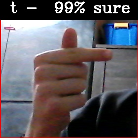
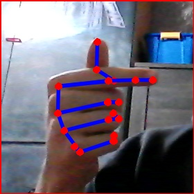

# Computer Vision as life facilitation for Deaf and Hard of hearing in Poland - Intel AI 4 Youth Project
## [PL] Instrukcja Obługi:
#### W folderze projektu znajdują się: 
1. folder *examples*
2. folder *gestures\_database*
3. folder *keypoint\_hand\_model* 
4. folder *working\_on\_project* 
5. skrypt *sign\_alphabet\_recognition.py* 
6. skrypt *train\_model.py* 
7. model *gesture\_recognition\_model.h5*

### 1. Folder examples
W folderze znajdują się przykładowe zdjęcia pokazujące ułożenie ręki w języku migowym odpowiadające danej literze, oraz odpowiedni szkielet który powinien zostać odwzorowany, poniżej przykład dla litery t:

 

### 2. Folder gestures\_database
Jest to baza wszystkich zgromadzonych przez nas gestów, znajduje się tam podfolder dla każdej litery jaką trenowaliśmy. Każda 'sesja' trenowania danej litery jest zapisana w folderze jako trzycyfrowa liczba - numer sesji. Kiedy w programie decydujemy się trenować litere dla przykładu 'a', program najpierw stworzy folder sesji. Powiedzmy że w folderze 'a' znajdują się już 3 sesje - '000', '001', '003' (002 została z jakiegoś powodu usunięta), program stworzy folder '004' a następnie trafią tam wszystkie gesty wykonane w czasie działania programu. Foldery sesji oraz pliki wewnątrz nich można bez problemu usuwać, nie spowoduje to nieprawidołego działania programu.

### 3. Folder keypoint\_hand\_model
Jest to folder z gotowym wytrenowanym modelem, którego zadaniem jest znajdowanie kluczowych punktów dłoni. Na podstawie tych właśnie punktów generowany jest szkielet, który następnie wykorzystujemy do stworzenia danych treningowych. Model został pobrany ze strony [learnopencv.com](https://www.learnopencv.com/hand-keypoint-detection-using-deep-learning-and-opencv/)

### 4. Folder working\_on\_project 
W Folderze znajduje się pokazowe video obrazujące jak działa program *sign\_alphabet\_recognition.py* 

### 5. Skrypt sign\_alphabet\_recognition.py
Główny skrypt który służy do rozpoznawania gestów pokazywanych przez użytkownika oraz zbierania danych treningowych. Na starcie programu użytkownik ma możliwość włączenia 'trybu kolekcji' wpisując **yes** w odpowiedzi na pytanie programu. Podając jakąkolwiek inną odpowiedź, program pozostawi tryb kolekcji wyłączony.

Następnie program policzy parę wstępnych wartości takich jak czas wyświetlania jednej klatki oraz numer ostatniej sesji treningowej

Na głównym ekranie ('video') będzie wyświetlana wiadomość którą zapiszemy używając podanych poniżej skrótów klawiszowych

#### Uruchomienie:
Skrypt został napisany w języku python w wersji 3.6, należy upewnić się żę na komputerze zostały zainstalowane wszystkie potrzebne moduły (opencv, keras, sklearn, numpy) 
Skrypt uruchamiamy poleceniem
> python3 *sign\_alphabet\_recognition.py*

#### Obsługa programu:
Użytkownik w czasie działania programu ma dostępny interface z paroma poleceniami:

* **s** - Tworzy 'migawkę' (**s**napshot) wyznaczonego obszaru oraz tworzy szkielet i dane treningowe, następnie wysyła je do naszego modelu który, analizuje gest i przewiduje na jego podstawie, jaką litere alfabetu migowego pokazujemy. Dodaje również zwróconą przez model literę na koniec wiadomości.
* **x** - Usuwa ostatnią literę z wiadomosci.
* **c** - Czyści (**c**lean) całą do tej pory napisaną wiadomość.
* **r** - Włącza tryb nagrywania (**r**ecord) - każda\* klatka przechwycona jest analizowana i wykonywana jest funkcja **s**napshot.
* **'SPACJA'** - Dodaje na końcu wiadomości spację.
* **'ESC'** - Wychodzi z programu.

Jeżeli 'tryb kolekcji' jest **włączony**:
* **d** - Ostatnio wykonywana migawka jest zrzucana (**d**ump) do folderu obecnej sesji pod nazwą 'recordX.jpg' gdzie X jest numerem z kolei wykonywanego zrzutu
* **r** - Tryb nagrywania działa podobnie jak gdy tryb kolekcji jest wyłączony, tyle że po każdej migawce jest wykonywana funkcja **d**ump 

\* Przetworzenie jednej klatki (**s**napshot) zajmuje ok 0.5 sekundy, a średni czas trwania jednej klatki na naszym komputerze wynosił 0.13 sekundy, zatem po każdym przetworzeniu następuje moment 'nadrabiania' w ktorym klatki są wczytywane w pętli tak długo aż nie wrócimy do rejestrowania w czasie rzeczywistym

#### Porady:
* Zadbaj o odpowiednie światło, im bardziej twoja ręka będzie wyróżniać się na tle otoczenia, tym większe prawdopodobieństwo poprawnego odgadnięcia gestu 
* Postaraj się odwzorować gest jak najlepiej, jeżeli model myli się co do wyświetlanej litery, spróbuj zobaczyć czy twój gest przypomina ten w folderze *examples*, (**rotacja ręki ma znaczenie**)
* Upewnij się, że narysowany na ekranie szkielet odzwierciedla faktyczny gest, który pokazujesz, może zdarzyć się, że przez pomyłkę 1 modelu, drugi błędnie odczyta pokazywany gest

